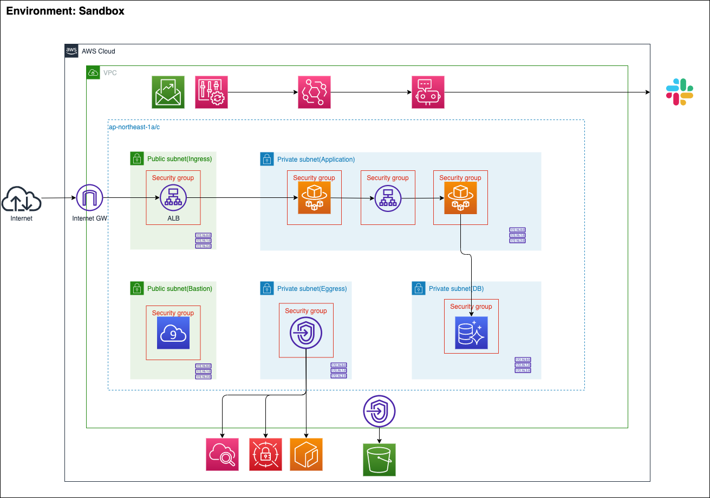

# ecs-learn
書籍「AWSコンテナ設計・構築[本格]入門」プラクティス用リポジトリ  
[書籍リンク](https://www.sbcr.jp/product/4815607654/)

## Terraform

[Terraform実行方法](./terraform/Terraform.md)

## Sandbox

### システム構成図

### 詳細設計

構成: ap-northeast-1 マルチAZ構成(AZ: 1a/1b/1c)

#### 命名規則

sandbox-{リソース名}-{種別}-{用途}-{az名}

#### ネットワーク

CIDR

|VPC名|IPv4 CIDR|
|:-|:-|
|sandbox-vpc|10.0.0.0/16|

Subnet

|用途|NW区分|AZ|CIDR|リソース名|
|:-|:-|:-|:-|:-|
|Ingress用|Public|1a|10.0.0.0/24|sandbox-subnet-public-ingress-1a|
|^ |Public|1c|10.0.1.0/24|sandbox-subnet-public-ingress-1c|
|^ |Public|1d|10.0.2.0/24|sandbox-subnet-public-ingress-1d|
|アプリケーション用|Private|1a|10.0.10.0/24|sandbox-subnet-private-app-1a|
|^ |Private|1c|10.0.11.0/24|sandbox-subnet-private-app-1c|
|^ |Private|1d|10.0.12.0/24|sandbox-subnet-private-app-1d|
|DB用|Private|1a|10.0.20.0/24|sandbox-subnet-private-db-1a|
|^ |Private|1c|10.0.21.0/24|sandbox-subnet-private-db-1c|
|^ |Private|1d|10.0.22.0/24|sandbox-subnet-private-db-1d|
|Bastion用|Public|1a|10.0.240.0/24|sandbox-subnet-public-bastion-1a|
|Bastion(予備)用|Public|1c|10.0.241.0/24|sandbox-subnet-private-bastion-1c|

Internet Gateway

|リソース名|VPC名|
|:-|:-|
|sandbox-igw|sandbox-vpc|

Route Table

Security Group